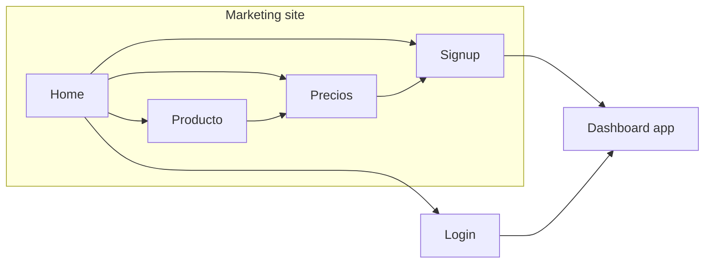

# HabemusDandy marketing site — baseline

This is the source of truth for information architecture, sections, and look of the public site. It is inspired by [Calendly](https://calendly.com/?redirect=false), [Cal.com](https://cal.com/es/), and [Koalendar](https://koalendar.com/), then brought down to **HabemusDandy**: clinic operations software, not a generic meeting scheduler.

Copy language: **Spanish**. Dashboard login/signup stay in `Habemusfisio-ui`.

---

## 1. What those three sites actually do

They sell different brands, but the **page machine** is the same.

| Pattern | Calendly | Cal.com | Koalendar |
| --- | --- | --- | --- |
| Promise | Scheduling is simple, at any scale | Customizable scheduling infrastructure | Smart scheduling, forever free |
| Hero | One line + dual CTA + product UI | One line + dual signup + live booking widget | One line + “no card” + product UI |
| Proof | Fortune 500 / 100k orgs | Fast-growing company logos | 10k+ professionals, store ratings |
| How it works | 5-step product walkthrough | 3 numbered steps | “Ready in minutes” |
| Features | Benefit + screenshot, then integrations | Deep feature grid + reminders | Feature clusters + verticals |
| Pricing | Homepage teaser + `/pricing` matrix | Homepage light, `/pricing` heavy | Homepage comparison table |
| Trust close | Case-study metrics, security | Testimonials, FAQ, HIPAA/SOC | Reviews, professions, FAQ-ish chat |
| CTAs | Start free + Get a demo | Comienza + Habla con ventas | Start free (self-serve first) |

Shared chrome, every time:

- Sticky header: logo, product, pricing, login, primary CTA
- Dual CTAs: self-serve vs sales (Calendly/Cal). Koalendar leans self-serve.
- Homepage as a **story**, not a dump of features
- Product UI in the hero (the site *shows* the tool)
- Footer as a sitemap
- Repeated “start now” band before the footer

What we **do not** copy:

- Calendly’s “for every meeting in the Fortune 500”
- Cal.com’s open-source / developer / self-host story
- Koalendar’s koala-mascot warmth and “every profession” grid (sales, barbers, photographers…)
- Fake logos, invented metrics, or competitor comparison tables until we have real numbers

What we **do** take:

- Calendly’s calm, spacious, enterprise-quiet layout
- Cal.com’s “show the real product” hero and a short how-it-works
- Koalendar’s plain-language benefits and a pricing page that is scannable
- All three: homepage teaser → dedicated `/precios`, features on homepage → dedicated `/producto`

---

## 2. Our positioning

HabemusDandy is the **operating system of the clinic**, not a booking link.

Calendly / Cal / Koalendar stop at “someone picks a time.” We continue into the visit: client record, intake, services, clinical notes, hours, and staff administration.

**Audience:** owners and staff of small-to-mid clinics (physio first, other practices later). Spanish-speaking, self-serve.

**Job to be done:** stop running the practice from WhatsApp, paper, and a shared Google Calendar.

**Promise (working):**
*La clínica, en un solo lugar.*
Agenda, clientes, formularios e historial clínico — sin el ida y vuelta.

**Not this:** “The smartest way to schedule meetings.”
**This:** “The clinic runs itself while you treat.”

Three product pillars (`/producto`; homepage teases them via setup, capabilities, and journey):

1. **Agenda** — hours, services, appointments, calendar sync
2. **Clientes** — records, intake forms, planned reminders
3. **Clínica** — notes, continuity of care, staff admin

If a section does not serve one of those pillars, it does not belong on v1.

---

## 3. Site map

Keep the first version small. These sites look large in the footer; their **conversion path** is three pages plus auth.

```text
habemusdandy.com                    marketing (this repo)
app.habemusfisio.com                dashboard (Habemusfisio-ui)

/                   Home
/producto           Product / features
/precios            Pricing
/seguridad          Privacy & trust (short)
/login              → app login
/signup             → app signup (or login while signup is gated)

Legal (footer only, later): /privacidad, /terminos
```

Out of v1: blog, use-case microsites, careers, changelog, “vs Calendly”, comparison tables, chatbot.



---

## 4. Global chrome

### Header (sticky, light)

| Left | Center | Right |
| --- | --- | --- |
| Logo wordmark | Producto · Precios | Iniciar sesión · **Comenzar** |

- `Comenzar` is the only filled button (brand `#1769e0`). Label in UI: `Comenzar gratis`.
- `Iniciar sesión` is text. Same dual-path as Calendly, without a “Talk to sales” until we have sales.
- On mobile: logo + Comenzar; the rest in a simple drawer. Do not copy mega-menus.
### Footer

Four columns, quiet:

1. Producto, Precios, Seguridad
2. Iniciar sesión, Comenzar
3. Privacidad, Términos (placeholders until legal exists)
4. Short brand line + email

No 40-link Cal.com footer. No social proof wall in the footer.

### Dual CTA rule

Every major band ends with **Comenzar**. Secondary link is **Ver precios** or **Ver producto**, never a second competing primary.

---

## 5. Home (`/`) — section by section

This is the page that has to work alone. Order is the conversion story, not the org chart.

**Shipped order:**
Hero → Problem → Setup (`#como-funciona`) → Operational breadth bento → Integrations → Pricing teaser → Journey (`#recorrido`) → FAQ → Closing CTA

Do **not** ship Agenda/Clientes homepage pillars or a warm mid-page CTA. Continuity lives in Journey and `/producto`.

### 5.1 Hero

- Eyebrow (status-dot pill): `Para clínicas`
- H1: `Tu clínica ordenada, de la cita al seguimiento.`
- Sub: `Agenda, formularios, fichas y notas clínicas en un solo flujo. Menos mensajes pendientes; más tiempo para atender.`
- CTAs: `Comenzar gratis` + `Ver cómo funciona` (anchor `#como-funciona`)
- Trust line under buttons: `Plan gratuito` · `Configuración en minutos` (do not claim “sin tarjeta”)
- **Visual:** first screen. `min-height: calc(100svh - var(--header-h))`, content vertically centered, extra bottom padding so Problem starts on the next scroll. Split layout from 900px (copy left, product right). Cropped CSS mock: no sidebar, Lun–Mié; crop days may be slightly taller. Signal cards sit on the frame and enter once it is visible. On small screens, copy then compact 2-day mock. No isometric 3D, no mascot, no stock photography. Do not restore sidebar or a 5-day week.
- On screens below 900px, retain compact `Ingreso completo` and `Nota lista` signals below the product visual; they must remain readable and unclipped.

### 5.2 Logo / proof strip

A single quiet line, then 4–6 marks **only when real**. Until then, skip this section rather than inventing “trusted by.”

Optional later: a metric row *only with real data* (citas, clínicas, no-show drop). Koalendar’s “10M+ classes” pattern is useful; fake numbers are not.

### 5.3 Problem

Separate chapter after the hero: extra top padding (~4–5rem) and a warm/paper band (`--color-warm` mix) so Hero and Problem do not share one canvas.

Three short columns. Pain the owner already feels, shown as CSS scenes (decorative, `aria-hidden`; titles/lines are the accessible content). No WhatsApp branding.

Problem and Setup cards share one rhythm: equal card height, fixed visual zone (~11rem, content centered), title + body pinned below with min-height (~2-line title, ~3-line body) so H3s align.

| Scene | Title | Line |
| --- | --- | --- |
| Chat (`¿Tienes el jueves a las 5?` → `Deja checo y te aviso` → muted “Sin respuesta · 2 h”) | Dijiste que revisabas y no contestaste | El interesado pregunta si hay hueco. Tú ibas a mirar el horario. El mensaje se quedó visto. |
| Sparse ficha / visits greyed / “sin historial” | Cada visita empieza de cero | Lo de la sesión pasada no está en la ficha. Vuelves a preguntar lo que ya sabías. |
| `Sesión 6 · finalizada` + `Sin próxima` + `Plan no registrado` | La sesión termina y el hilo se corta | No hay próxima cita, ni plan a la vista, ni recordatorio. El seguimiento vive en la cabeza. |

Headline: `Hoy la clínica se arma en el chat.`

### 5.4 Setup (how it works)

Centered intro, id `como-funciona` (Cal-style 3-step, our product):

- Label: `Cómo funciona`
- H2: `Empezar no debería tomar una semana.`
- Lead: `Horario, servicios y la primera cita. El resto del flujo ya está en el mismo sitio.`
- Buttons: `Comenzar gratis` (primary) + `Ver el flujo de una visita` (ghost, `#recorrido`)

Three equal-height cards matching Problem: muted number pills (01–03), fixed focused micro-scene ProductFrame zone, then title + line. The scenes stay readable at desktop scale: availability, reservation confirmation, and a prepared client record rather than tiny full-interface screenshots:

| # | Title | Line | Frame |
| --- | --- | --- | --- |
| 01 | Define horario y servicios | Cuándo atiendes y qué ofreces | `hours` compact |
| 02 | Recibe la reserva | El hueco queda en la agenda, no en el chat | `agenda` crop/compact |
| 03 | Atiende con la ficha lista | Datos y visitas anteriores al abrir | `client` compact |

### 5.5 Product pillars

Homepage does **not** ship separate Agenda or Clientes bands. Those groups live on `/producto`; the Home breadth section below covers operational setup around the visit without repeating the Journey story.

Do **not** ship a separate Clínica homepage band.

### 5.6 Journey (how a visit flows)

Placed after pricing, before FAQ. Dark band, id `recorrido`. Headline: `El contexto avanza con cada visita.` Secondary text link: `Comenzar gratis`.

Four tabs (~6s each, crossfade). Autoplay starts only when `#recorrido` / `[data-journey]` intersects (`IntersectionObserver`). Pause off-screen and on hover/focus. A subtle mobile cue indicates that more tabs are horizontally available. A manual click or keyboard selection stops autoplay for that Journey instance. `prefers-reduced-motion`: no autoplay. Progress underline matches the step duration.

1. **La cita entra en la agenda** — horario y duración ya definidos
2. **El ingreso llega con tiempo** — formulario antes del box
3. **La ficha abre con contexto** — datos y visitas juntos
4. **El seguimiento queda preparado** — nota y plan en el mismo flujo

Tab statuses may keep product-state wording (including “Ingreso”). Agenda visual rule: hero keeps the cropped week; journey step 1 may reuse agenda inside journey chrome.

### 5.7 Operational breadth

Label: `Más que una agenda`. Title: `Todo lo que sostiene la clínica, también está aquí.` Lead: `Organiza el día, configura servicios, prepara formularios y define quién puede hacer qué.`

Use an asymmetric editorial bento: one dominant **Panel principal** scene for today’s appointments, statuses, quick actions, and pending intake; four smaller operational tiles for **Servicios** (duration, price, accent color), **Formularios** (branded/custom intake, consent/signature), **Horario** (weekly availability, date exceptions, timezone), and **Equipo y roles** (Owner/Manager/Staff access). The dominant panel and four tiles are static focused ProductFrame/CSS scenes, not tiny full-app screenshots, icon soup, or another carousel. Give the four smaller tiles enough separation to read as independent objects, using stronger soft shadows, restrained category accents, and lightly tinted visual stages rather than heavy borders. Desktop uses a 12-column composition; tablet uses a balanced dominant-plus-2×2 treatment; mobile stacks without overflow. One CTA, `Ver todas las capacidades`, points to `/producto`.

The problem section flows into Setup through one short narrative bridge, not solution badges repeated inside each problem card.

### 5.8 Mid-page CTA

Do **not** ship a warm mid-page CTA. The closing navy band is the only full-width CTA on the homepage.

### 5.9 Integrations

One quiet shared strip/row: Google Calendar + Apple Calendar. Keep the truthful statuses (`Una vía` and `Solo lectura`) and the headline `Se conecta con lo que ya usas.` Text link to `/producto#integraciones`.
Do not show Zoom/Salesforce/Zapier just because Calendly does.

### 5.10 Pricing teaser

Three plan cards: **Gratis**, **Equipos** (`$249/mes` or `$199/mes` with a $2,388 annual payment), and **Empresas** (contact sales). A compact `Mensual / Anual` toggle appears above the cards on Home and `/precios`; Mensual is the default and Anual carries a truthful `Ahorra 20%` label. Equipos shows a visible `Recomendado` pill and a solid primary CTA on both Home and `/precios`; Gratis remains ghost and Empresas remains a text link. Link to `Ver precios` / comparar planes; do not publish competitor comparison tables.

### 5.11 Testimonials

Two or three quotes max, with name, clinic, city. Empty until real. Do not use Cal.com’s scrolling wall of tweets.

### 5.12 FAQ (5–7 questions)

Two-column on desktop: intro left (optional text link `Comenzar gratis`, not a second primary button), accordion list right. Open panels animate height; reduced motion = instant.

Draft:

1. ¿Es solo para fisioterapia?
2. ¿Mis pacientes necesitan una cuenta?
3. ¿Se sincroniza con Google Calendar?
4. ¿Puedo usar mis propios formularios?
5. ¿Qué pasa con los datos de los pacientes?
6. ¿Puedo empezar gratis?
7. ¿Funciona en el celular?

Answers: two to four sentences. Link `/seguridad` from the data question.

### 5.13 Closing CTA

Full-width navy band.
H2: `Empieza a ordenar la clínica.`
Buttons: `Comenzar gratis` + `Ver precios`.
Right side: quiet 4-step strip — Reserva → Formulario → Sesión → Seguimiento (`showFlow` on homepage only).
---

## 6. Producto (`/producto`)

Calendly `/features` shape: hero, then grouped capabilities, then CTA. Not a second homepage.

**Hero:** `Un flujo clínico, no seis herramientas separadas.` + `Comenzar gratis` / `Ver precios`
**Hero visual:** one agenda ProductFrame under the hero copy.

**Groups** (match the live dashboard, not a scheduler feature list):

1. **Panel principal** — citas de hoy, estados, acciones rápidas, ingresos pendientes
2. **Agenda** — Citas, Servicios, Horario (excepciones y zona horaria), calendario
3. **Clientes** — perfil, fichas, visitas e historial
4. **Clínica** — notas, seguimiento y continuidad
5. **Formularios** — diseñador de ingreso, marca, consentimiento y firma
6. **Administración** — usuarios, roles Owner/Manager/Staff, branding y configuración
7. **Integraciones** — Google Calendar y Apple Calendar, únicamente lo que está vivo
8. **Próximamente: Workflows** — recordatorios y reglas de seguimiento planeados, no disponibles todavía

Each group: H2, short intro, 4–6 items (title + one line). One product mock per group, not per item.

Close with the same CTA band as home.

---

## 7. Precios (`/precios`)

Calendly `/pricing` shape, Koalendar scannability, our plans.

1. H1: `Un plan por clínica, no por caos.`
2. Billing toggle (`Mensual` by default; `Anual` shows the $199/month equivalent and $2,388 annual charge)
3. Plan cards (audience label, price, 5–8 bullets, CTA)
4. Feature comparison table (rows grouped: Agenda, Clientes, Clínica, Equipo)
5. FAQ (seats vs clinic, trial, invoices, what happens if you cancel)
6. Closing CTA

Do not add “vs Calendly / Cal.com / Koalendar.” Different category; that table would confuse the buyer.

Plans: Gratis, Equipos (`$249/mes`, or `$199/mes` paid annually), and Empresas (contact sales).

---

## 8. Seguridad (`/seguridad`)

Short trust page (Calendly “built to keep you secure,” without enterprise theater).

- Who can see clinic data (tenant isolation, roles)
- What patients see (intake link, no dashboard)
- What we do not do
- Link to privacy policy when it exists

No SOC/HIPAA badges unless they are real.

---

## 9. Look and feel

Luxury refined minimalism, same family as the dashboard — marketing is allowed to use real titles and a larger hero.

| Token | Value |
| --- | --- |
| Type | Outfit |
| Ink | `#171717` |
| Muted | `#6b6b68` |
| Paper | `#fafaf8` |
| Surface | `#ffffff` |
| Brand | `#1769e0` — primary actions and focus only |
| Depth | Soft shadow, no card borders |
| Radius | Medium, same as product |
| Motion | Fade/slide on scroll, one-shot product-state reveals in Setup and the operational bento, Journey crossfade (~6s), FAQ height; respect `prefers-reduced-motion` |

**Closer to Calendly than Koalendar:** lots of air, typography hierarchy, product shots on paper, and an editorial monochrome shell. Color comes from product UI, icons, motion states, and restrained primary actions.
**Closer to Cal.com than Calendly:** the screenshot *is* our app, not an illustrated metaphor.
**Not Koalendar:** no mascot, no rainbow of vertical cards, no “free forever” personality unless that is the real offer.

Rules:

- One H1 per page
- Section labels are small + muted; section titles are large + light-to-medium weight
- Primary button once per band
- Dual CTAs: self-serve primary; secondary is text or ghost (`Ver precios`, `Ver producto`, `Ver cómo funciona`)
- Status and proof use dots / quiet text, not filled badges (except pricing `Recomendado` pill)
- Product UI mocks use existing status/appointment tokens for quiet color — not beige + one blue button only
- No hardcoded one-off colors; CSS variables only
- No Calendly organic blobs / illustration style
- Static HTML first. JS only for the header drawer, billing toggle, journey tabs, FAQ accordion, reveal, and one-shot product-state entry. Animate product state, never bouncing marketing text. Setup reveals availability blocks, a settling reservation, and ficha rows once; the bento reveals panel rows plus service/form/horario/role states once; Journey re-triggers only the newly active panel’s product state. Reduced motion shows final state immediately.
---

## 10. Voice

- Address the clinic owner: `tú`
- Concrete nouns: cita, ficha, horario, inasistencia — not “sinergias”
- Short sentences. One idea per heading
- Spanish from Spain/LatAm-neutral; match dashboard copy (`Citas`, `Clientes`, `Formularios`)
- Never claim a feature the app does not ship

---

## 11. v1 vs later

**v1 (this repo, now)**

- Chrome (header/footer)
- Home with all sections except empty proof/testimonials (omit if empty)
- `/producto`, `/precios` (structure), `/seguridad` (short)
- CTAs pointing at the app

**Later**

- Real logos, quotes, metrics
- Sales / demo CTA
- Legal pages
- Blog or guides
- Extra locales
- Comparison or “vs” pages only if we compete with clinic software, not with Calendly

---

## 12. Implementation notes

- Astro pages, shared `BaseLayout`, CSS variables in global styles
- Product shots: real dashboard captures (light scheme), lightly framed
- `Comenzar` / `Iniciar sesión` are absolute URLs to the app origin (env), defaulting to `https://app.habemusfisio.com`
- No auth, no org context, no API client in this repo
