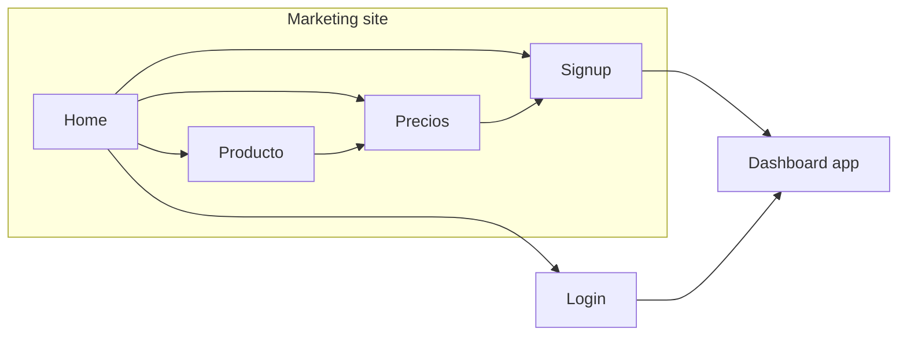

# HabemusDandy marketing site — baseline

This is the source of truth for information architecture, sections, and look of the public site. It is inspired by [Calendly](https://calendly.com/?redirect=false), [Cal.com](https://cal.com/es/), and [Koalendar](https://koalendar.com/), then brought down to **HabemusDandy**: clinic operations software, not a generic meeting scheduler.

Copy language: **Spanish**. Dashboard login/signup stay in `Habemusfisio-ui`.

---

## 1. What those three sites actually do

They sell different brands, but the **page machine** is the same.

| Pattern | Calendly | Cal.com | Koalendar |
| --- | --- | --- | --- |
| Promise | Scheduling is simple, at any scale | Customizable scheduling infrastructure | Smart scheduling, forever free |
| Hero | One line + dual CTA + product UI | One line + dual signup + live booking widget | One line + “no card” + product UI |
| Proof | Fortune 500 / 100k orgs | Fast-growing company logos | 10k+ professionals, store ratings |
| How it works | 5-step product walkthrough | 3 numbered steps | “Ready in minutes” |
| Features | Benefit + screenshot, then integrations | Deep feature grid + reminders | Feature clusters + verticals |
| Pricing | Homepage teaser + `/pricing` matrix | Homepage light, `/pricing` heavy | Homepage comparison table |
| Trust close | Case-study metrics, security | Testimonials, FAQ, HIPAA/SOC | Reviews, professions, FAQ-ish chat |
| CTAs | Start free + Get a demo | Comienza + Habla con ventas | Start free (self-serve first) |

Shared chrome, every time:

- Sticky header: logo, product, pricing, login, primary CTA
- Dual CTAs: self-serve vs sales (Calendly/Cal). Koalendar leans self-serve.
- Homepage as a **story**, not a dump of features
- Product UI in the hero (the site *shows* the tool)
- Footer as a sitemap
- Repeated “start now” band before the footer

What we **do not** copy:

- Calendly’s “for every meeting in the Fortune 500”
- Cal.com’s open-source / developer / self-host story
- Koalendar’s koala-mascot warmth and “every profession” grid (sales, barbers, photographers…)
- Fake logos, invented metrics, or competitor comparison tables until we have real numbers

What we **do** take:

- Calendly’s calm, spacious, enterprise-quiet layout
- Cal.com’s “show the real product” hero and a short how-it-works
- Koalendar’s plain-language benefits and a pricing page that is scannable
- All three: homepage teaser → dedicated `/precios`, features on homepage → dedicated `/producto`

---

## 2. Our positioning

HabemusDandy is the **operating system of the clinic**, not a booking link.

Calendly / Cal / Koalendar stop at “someone picks a time.” We continue into the visit: client record, intake, services, clinical notes, hours, automations.

**Audience:** owners and staff of small-to-mid clinics (physio first, other practices later). Spanish-speaking, self-serve.

**Job to be done:** stop running the practice from WhatsApp, paper, and a shared Google Calendar.

**Promise (working):**
*La clínica, en un solo lugar.*
Agenda, clientes, formularios e historial clínico — sin el ida y vuelta.

**Not this:** “The smartest way to schedule meetings.”
**This:** “The clinic runs itself while you treat.”

Three product pillars (homepage and `/producto`):

1. **Agenda** — hours, services, appointments, calendar sync
2. **Clientes** — records, intake forms, reminders / workflows
3. **Clínica** — notes, continuity of care, staff admin

If a section does not serve one of those pillars, it does not belong on v1.

---

## 3. Site map

Keep the first version small. These sites look large in the footer; their **conversion path** is three pages plus auth.

```text
habemusdandy.com                    marketing (this repo)
app.habemusfisio.com                dashboard (Habemusfisio-ui)

/                   Home
/producto           Product / features
/precios            Pricing
/seguridad          Privacy & trust (short)
/login              → app login
/signup             → app signup (or login while signup is gated)

Legal (footer only, later): /privacidad, /terminos
```

Out of v1: blog, use-case microsites, careers, changelog, “vs Calendly”, comparison tables, chatbot.



---

## 4. Global chrome

### Header (sticky, light)

| Left | Center | Right |
| --- | --- | --- |
| Logo wordmark | Producto · Precios | Iniciar sesión · **Comenzar** |

- `Comenzar` is the only filled button (brand `#1769e0`). Label in UI: `Comenzar gratis`.
- `Iniciar sesión` is text. Same dual-path as Calendly, without a “Talk to sales” until we have sales.
- On mobile: logo + Comenzar; the rest in a simple drawer. Do not copy mega-menus.
### Footer

Four columns, quiet:

1. Producto, Precios, Seguridad
2. Iniciar sesión, Comenzar
3. Privacidad, Términos (placeholders until legal exists)
4. Short brand line + email

No 40-link Cal.com footer. No social proof wall in the footer.

### Dual CTA rule

Every major band ends with **Comenzar**. Secondary link is **Ver precios** or **Ver producto**, never a second competing primary.

---

## 5. Home (`/`) — section by section

This is the page that has to work alone. Order is the conversion story, not the org chart.

**Shipped order:**
Hero → Problem → Journey → Agenda → Clientes → Clínica → Feature mosaic → Mid-page CTA → Integrations → Pricing teaser → FAQ → Closing CTA

### 5.1 Hero

- Eyebrow (status-dot pill): `Para clínicas`
- H1: `Tu clínica ordenada, de la cita al seguimiento.`
- Sub: `Agenda, formularios, fichas y notas clínicas en un solo flujo. Menos mensajes pendientes; más tiempo para atender.`
- CTAs: `Comenzar gratis` + `Ver cómo funciona` (anchor `#recorrido`)
- Trust line under buttons: `Plan gratuito` · `Configuración en minutos` (do not claim “sin tarjeta”)
- **Visual:** framed CSS product mock of the weekly agenda (busy clinic). Signal cards enter once after the hero frame is visible, then float slightly (desktop only). No isometric 3D, no mascot, no stock photography.

### 5.2 Logo / proof strip

A single quiet line, then 4–6 marks **only when real**. Until then, skip this section rather than inventing “trusted by.”

Optional later: a metric row *only with real data* (citas, clínicas, no-show drop). Koalendar’s “10M+ classes” pattern is useful; fake numbers are not.

### 5.3 Problem

Three short columns. Pain the owner already feels:

| La cita vive en un chat | El ingreso llega tarde | La historia queda atrás |
| --- | --- | --- |
| Confirmaciones, cambios y pendientes se dispersan entre mensajes | Los datos importantes se preguntan cuando la sesión ya empezó | Notas, acuerdos y siguientes pasos terminan en lugares distintos |

No icons soup. Small brand-tint marks or nothing. Headline: `La atención no debería empezar buscando información.`

### 5.4 Journey (how a visit flows)

Four autoplay tabs (~6s each, crossfade, pause on hover/focus). Progress underline matches the step duration. Respect `prefers-reduced-motion`.

1. **La cita entra en la agenda** — horario y duración ya definidos
2. **El ingreso llega con tiempo** — formulario antes del box
3. **La ficha abre con contexto** — datos y visitas juntos
4. **El seguimiento queda preparado** — nota y plan en el mismo flujo

Headline: `El contexto avanza con cada visita.` Secondary text link: `Comenzar gratis`.

Agenda visual rule: hero keeps the full-week agenda; journey step 1 may reuse agenda inside journey chrome; Agenda pillar uses a distinct cut (`hours` / horario), not a third paste of the hero week.

### 5.5 Product pillars (alternating feature bands)

Three large bands, screenshot left/right alternating, generous whitespace (Calendly), product UI mocks (Cal.com).

1. **Agenda que respeta tu horario**
   Horario, servicios, citas, sincronización de calendario.
   Visual: horario / disponibilidad (`hours` variant), not the hero week again.

2. **Clientes con historia, no solo un nombre**
   Ficha, ingreso, visitas recientes.
   Visual: enriched client frame (resumen, ingreso checklist, visit list, previous-session chip).

3. **Notas y seguimiento en el mismo sitio**
   Continuidad clínica, no un PDF suelto.
   Visual: enriched note frame (previous-session chip + side findings).

Each band: H2, one paragraph, 3 bullets, link `Ver producto` (section anchor). Vary wording; do not overuse `contexto` outside the journey.

### 5.6 Feature mosaic

A 2×3 grid (1–2 cols on small screens) of shipped capabilities only. Scannable cards (title + one line), linking to `/producto#…`. Do not put full ProductFrames in the mosaic.

| Tile | One-liner |
| --- | --- |
| Horario | Disponibilidad real de la clínica |
| Servicios | Duración y tipo de atención |
| Formularios | Ingreso antes de la visita |
| Workflows | Recordatorios y seguimiento |
| Calendario | Google y Apple |
| Equipo | Roles en un solo espacio |

### 5.7 Mid-page CTA

Warm / paper treatment (not a second navy slab). Primary `Comenzar gratis` + secondary `Ver producto`. Distinct from the closing navy band.

### 5.8 Integrations

One row: Google Calendar + Apple Calendar. Headline: `Se conecta con lo que ya usas.` Text link to `/producto#integraciones`.
Do not show Zoom/Salesforce/Zapier just because Calendly does.

### 5.9 Pricing teaser

Three plan cards: **Gratis**, **Equipos** (`$249/mes` or `$200/mes` with annual payment), and **Empresas** (contact sales). Equipos shows a visible `Recomendado` pill. Each card: 3 bullets + CTA. Link to `Ver precios` / comparar planes; do not publish competitor comparison tables.

### 5.10 Testimonials

Two or three quotes max, with name, clinic, city. Empty until real. Do not use Cal.com’s scrolling wall of tweets.

### 5.11 FAQ (5–7 questions)

Two-column on desktop: intro left (optional text link `Comenzar gratis`, not a second primary button), accordion list right. Open panels animate height; reduced motion = instant.

Draft:

1. ¿Es solo para fisioterapia?
2. ¿Mis pacientes necesitan una cuenta?
3. ¿Se sincroniza con Google Calendar?
4. ¿Puedo usar mis propios formularios?
5. ¿Qué pasa con los datos de los pacientes?
6. ¿Puedo empezar gratis?
7. ¿Funciona en el celular?

Answers: two to four sentences. Link `/seguridad` from the data question.

### 5.12 Closing CTA

Full-width navy band.
H2: `Empieza a ordenar la clínica.`
Buttons: `Comenzar gratis` + `Ver precios`.
Right side: quiet 4-step strip — Cita → Ingreso → Ficha → Nota.
---

## 6. Producto (`/producto`)

Calendly `/features` shape: hero, then grouped capabilities, then CTA. Not a second homepage.

**Hero:** `Un flujo clínico, no seis herramientas separadas.` + `Comenzar gratis` / `Ver precios`
**Hero visual:** one agenda ProductFrame under the hero copy.

**Groups** (match the dashboard, not a scheduler feature list):

1. **Agenda** — citas, horario, servicios, calendario
2. **Clientes** — fichas, ingreso, consentimiento
3. **Clínica** — notas, historial, continuidad
4. **Automatización** — workflows, recordatorios
5. **Equipo** — roles, administración
6. **Integraciones** — only live ones

Each group: H2, short intro, 4–6 items (title + one line). One product mock per group, not per item.

Close with the same CTA band as home.

---

## 7. Precios (`/precios`)

Calendly `/pricing` shape, Koalendar scannability, our plans.

1. H1: `Un plan por clínica, no por caos.`
2. Billing toggle when it exists
3. Plan cards (audience label, price, 5–8 bullets, CTA)
4. Feature comparison table (rows grouped: Agenda, Clientes, Clínica, Equipo)
5. FAQ (seats vs clinic, trial, invoices, what happens if you cancel)
6. Closing CTA

Do not add “vs Calendly / Cal.com / Koalendar.” Different category; that table would confuse the buyer.

Plans: Gratis, Equipos (`$249/mes`, or `$200/mes` paid annually), and Empresas (contact sales).

---

## 8. Seguridad (`/seguridad`)

Short trust page (Calendly “built to keep you secure,” without enterprise theater).

- Who can see clinic data (tenant isolation, roles)
- What patients see (intake link, no dashboard)
- What we do not do
- Link to privacy policy when it exists

No SOC/HIPAA badges unless they are real.

---

## 9. Look and feel

Luxury refined minimalism, same family as the dashboard — marketing is allowed to use real titles and a larger hero.

| Token | Value |
| --- | --- |
| Type | Outfit |
| Ink | `#171717` |
| Muted | `#6b6b68` |
| Paper | `#fafaf8` |
| Surface | `#ffffff` |
| Brand | `#1769e0` — primary actions and focus only |
| Depth | Soft shadow, no card borders |
| Radius | Medium, same as product |
| Motion | Fade/slide on scroll, journey crossfade (~6s), FAQ height, agenda appointment stagger; respect `prefers-reduced-motion` |

**Closer to Calendly than Koalendar:** lots of air, typography hierarchy, product shots on paper, and an editorial monochrome shell. Color comes from product UI, icons, motion states, and restrained primary actions.
**Closer to Cal.com than Calendly:** the screenshot *is* our app, not an illustrated metaphor.
**Not Koalendar:** no mascot, no rainbow of vertical cards, no “free forever” personality unless that is the real offer.

Rules:

- One H1 per page
- Section labels are small + muted; section titles are large + light-to-medium weight
- Primary button once per band
- Dual CTAs: self-serve primary; secondary is text or ghost (`Ver precios`, `Ver producto`, `Ver cómo funciona`)
- Status and proof use dots / quiet text, not filled badges (except pricing `Recomendado` pill)
- Product UI mocks use existing status/appointment tokens for quiet color — not beige + one blue button only
- No hardcoded one-off colors; CSS variables only
- No Calendly organic blobs / illustration style
- Static HTML first. JS only for header drawer, journey tabs, FAQ accordion, reveal, appointment stagger
---

## 10. Voice

- Address the clinic owner: `tú`
- Concrete nouns: cita, ficha, horario, inasistencia — not “sinergias”
- Short sentences. One idea per heading
- Spanish from Spain/LatAm-neutral; match dashboard copy (`Citas`, `Clientes`, `Formularios`)
- Never claim a feature the app does not ship

---

## 11. v1 vs later

**v1 (this repo, now)**

- Chrome (header/footer)
- Home with all sections except empty proof/testimonials (omit if empty)
- `/producto`, `/precios` (structure), `/seguridad` (short)
- CTAs pointing at the app

**Later**

- Real logos, quotes, metrics
- Sales / demo CTA
- Legal pages
- Blog or guides
- Extra locales
- Comparison or “vs” pages only if we compete with clinic software, not with Calendly

---

## 12. Implementation notes

- Astro pages, shared `BaseLayout`, CSS variables in global styles
- Product shots: real dashboard captures (light scheme), lightly framed
- `Comenzar` / `Iniciar sesión` are absolute URLs to the app origin (env)
- No auth, no org context, no API client in this repo
